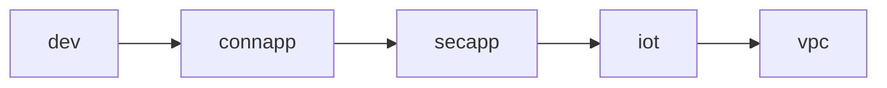

## Situation
When you have a platform on the cloud, surely you need to configure your devices to match the security obligations. AWS ensure transport security on your data with encryptation on the L2. By default you can connect to AWS IOT with transport security and ensure identity with certificates create ok the fly by AWS, but imagine you have a Certificate Authority.
You need to sign new certificates with your CA always a new devices request connection with the cloud. But how we can do it? 
Let's think about the problem.

## Description
The process of incorporate a new device on the iot service is call just-in-time registration. You can search details [here](https://aws.amazon.com/es/blogs/iot/just-in-time-registration-of-device-certificates-on-aws-iot/).

We have an own cert authority and want to register a new device that have a certificate issued by our CA. 

This process require some design before. Let's see it in more detail. 



### Certificate creation
The first step is create a CA. With the help of openssl you can do it easily. Simply try this command:

```bash
openssl
```


